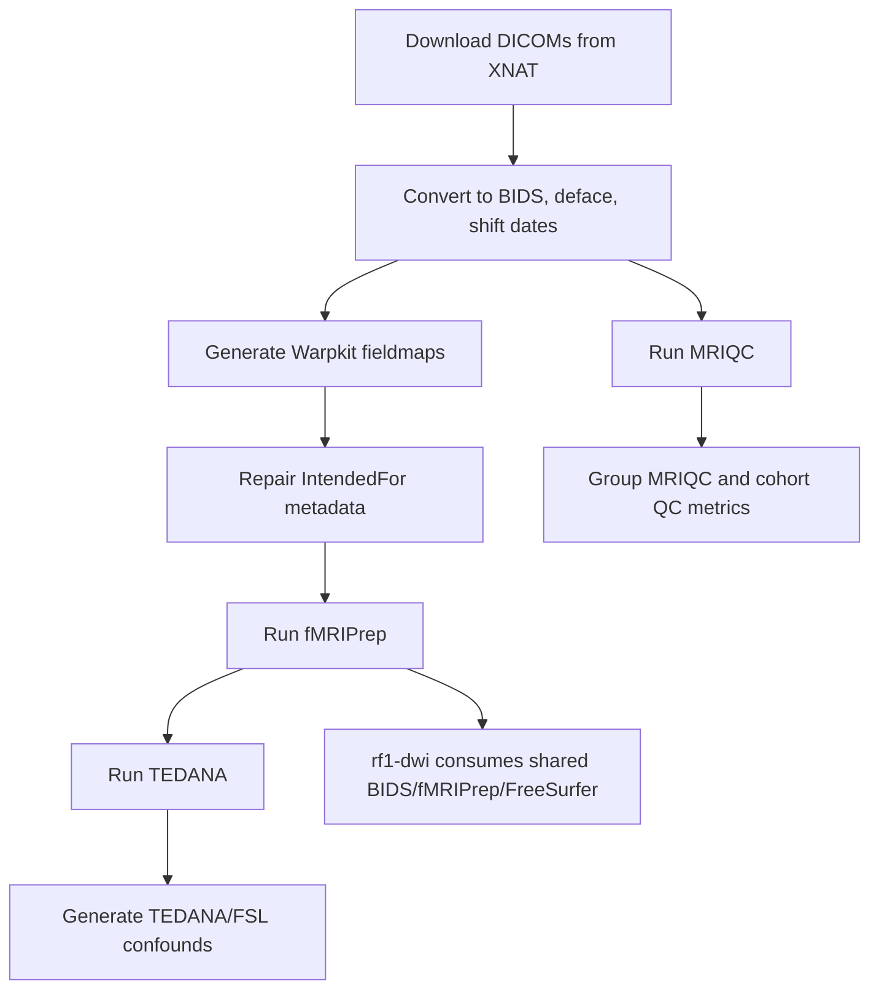

# RF1-SRA Linux2 fMRI Preprocessing

This repository contains the Smith Lab Linux2 preprocessing workflow for RF1-SRA
multi-echo fMRI data from the UGR, Social Doors, Trust, and Shared Reward tasks.
Behavioral task processing lives in separate repositories. This repository is
for MRI data management, BIDS conversion, fieldmap preparation, fMRIPrep,
FreeSurfer/CIFTI derivative generation, TEDANA, MRIQC, downstream confound
generation, and cohort-level metric extraction helpers.

## Scope And Privacy

Raw DICOMs are not stored in GitHub. On Linux2 they live under the lab-controlled
source-data area, normally `/ZPOOL/data/sourcedata/sourcedata/rf1-sra`. BIDS
NIfTI images, fMRIPrep derivatives, TEDANA outputs, MRIQC reports, scheduler
logs, temporary files, generated metrics, and the generated `bids/` tree are
intentionally excluded from version control.

Production processing should occur on Smith Lab Linux2. Common checkout paths
include the production project and separate validation clones, for example:

```bash
/ZPOOL/data/projects/rf1-sra-linux2
/ZPOOL/data/projects/rf1-sra-linux2-heudiconv14-test
```

The scripts derive `PROJECT_ROOT` from the checkout that is running them, so a
validation clone writes to its own `bids/`, `derivatives/`, and `logs/` trees.
Do not hard-code one project root into wrappers or downstream commands.

Do not run destructive production processing from an unreviewed branch. This
cleanup branch is repository-tested only and still requires Jacob's Linux2
integration validation before merge.

## Relationship To rf1-dwi

This repository is upstream of `rf1-dwi`. Run this fMRI/data-management workflow
first. It creates and maintains the shared BIDS dataset, fMRIPrep derivatives,
FreeSurfer subjects, and fsLR CIFTI outputs that `rf1-dwi` may consume for
QSIPrep/QSIRecon.

`rf1-dwi` should not duplicate BIDS, fMRIPrep, or FreeSurfer outputs. Instead,
point the DWI repo at the validated Linux2 checkout for this repo. Depending on
which checkout Jacob has validated, those paths may look like either of these:

```bash
BIDS_ROOT=/ZPOOL/data/projects/rf1-sra-linux2/bids
FMRIPREP_DERIVATIVES_DIR=/ZPOOL/data/projects/rf1-sra-linux2/derivatives/fmriprep
FREESURFER_SUBJECTS_DIR=/ZPOOL/data/projects/rf1-sra-linux2/derivatives/freesurfer

BIDS_ROOT=/ZPOOL/data/projects/rf1-sra-linux2-heudiconv14-test/bids
FMRIPREP_DERIVATIVES_DIR=/ZPOOL/data/projects/rf1-sra-linux2-heudiconv14-test/derivatives/fmriprep
FREESURFER_SUBJECTS_DIR=/ZPOOL/data/projects/rf1-sra-linux2-heudiconv14-test/derivatives/freesurfer
```

## Repository Layout

| Path | Purpose |
| --- | --- |
| `code/` | All production entry points, worker scripts, helpers, validation scripts, and the current batch subject list. |
| `bids/` | Generated BIDS dataset on Linux2; ignored by Git. |
| `derivatives/` | Generated outputs are ignored and should not contain repository code. |
| `tests/` | Synthetic pytest coverage for parsing, path generation, safety checks, and completion checks. |

See `code/README.md` for the detailed implementation manual.

## Software

The shared Linux2 source-data and tool paths are fixed in `code/pipeline_common.sh`.
The project root is derived from the checkout location so a separate validation
clone writes to its own `bids/`, `derivatives/`, and `logs/` directories.

| Tool | Default image/location |
| --- | --- |
| HeuDiConv | `/ZPOOL/data/tools/heudiconv-1.4.0.sif` |
| MRIQC | `/ZPOOL/data/tools/mriqc-24.0.2.simg` |
| fMRIPrep | `/ZPOOL/data/tools/fmriprep-25.2.5.simg` |
| Warpkit | `/ZPOOL/data/tools/warpkit.sif` |
| TemplateFlow | `/ZPOOL/data/tools/templateflow` |
| FreeSurfer license | `/ZPOOL/data/tools/licenses/fs_license.txt` |

The script comments historically said the scanner-upgrade heuristic cutoff was
March 18, 2025, while the code has used March 4, 2025 since the first Linux2
commit. This cleanup preserves the March 4 behavior and flags the discrepancy
for Jacob to confirm during Linux2 validation.

## Pipeline Map

The dependency order is:

```text
Raw DICOMs / XNAT
  -> rf1-sra-linux2 BIDS conversion
  -> rf1-sra-linux2 Warpkit / IntendedFor
  -> rf1-sra-linux2 fMRIPrep / FreeSurfer / CIFTI
  -> rf1-sra-linux2 TEDANA / MRIQC / confounds
  -> rf1-sra-linux2 cohort-level MRIQC metrics and outlier review
  -> rf1-dwi QSIPrep / QSIRecon
```

In this repository the modular stages are:



Quick start on Linux2:

```bash
cd /ZPOOL/data/projects/rf1-sra-linux2/code
# Update this file for each new batch, then run the standard commands.
vim sublist-new.txt
python3 downloadXNAT.py
bash run_prepdata.sh --dry-run
bash run_prepdata.sh
bash check_bids.sh
bash run_mriqc.sh --dry-run
bash run_mriqc.sh
bash check_mriqc.sh
bash run_warpkit.sh --dry-run
bash run_warpkit.sh
bash check_warpkit.sh
python3 addIntendedFor.py --dry-run
python3 addIntendedFor.py
bash run_fmriprep.sh --dry-run
bash run_fmriprep.sh
bash check_fmriprep.sh
bash run_tedana.sh --dry-run
bash run_tedana.sh
bash check_tedana.sh
python3 genTedanaConfounds.py --sublist sublist-new.txt --dry-run
python3 genTedanaConfounds.py --sublist sublist-new.txt
```

`--dry-run` means print or validate the planned work before launching the heavy
stage. `--sublist FILE` points a wrapper or checker at a review-specific subject
list instead of `code/sublist-new.txt`. `--jobs N` controls how many
subject-level jobs run at once; fMRIPrep also divides its CPU and memory budget
across those jobs.

`code/sublist-new.txt` is the only file operators should normally edit for a
new batch. It is a plain text file with one subject per line. Blank lines and
comments beginning with `#` are ignored, and either `10001` or `sub-10001`
forms are accepted by the wrappers. Scripts should not need edits for routine
new-batch processing.

## Sessions And Expected Absences

Many RF1-SRA participants have both `ses-01` and `ses-02`. The production
wrappers try or discover both sessions, and optional missing `ses-02` source
data are reported as skips rather than hidden.

The current task/session rules are intentionally narrow and tested:

| Session | Expected tasks |
| --- | --- |
| `ses-01` | UGR, Trust, Shared Reward, Doors, Social Doors |
| `ses-02` | UGR, Doors, Social Doors |

UGR, Trust, and Shared Reward use runs 1 and 2 when present. Doors and Social
Doors generally lack run 2, so the wrappers and checkers expect run 1 only.
Some participants may intentionally lack a task or run; validation notes should
say whether an absence is expected or requires investigation.

For Linux2 smoke validation, prefer subjects that overlap with the `rf1-dwi`
smoke subjects, such as `10317` and `10953`, when they cover useful fMRI data.
Because this repository must validate multi-session behavior, Jacob's final
test set should also include at least one `ses-01`, at least one `ses-02`, at
least one intentionally absent task/run, and ideally one pre-upgrade and one
post-upgrade scanner/heuristic case if available. Keep that validation list as
a review artifact; do not make it a production default unless David asks.

## Safety And Reruns

Use `--dry-run` first for pipeline stages that support it. `prepdata.sh` runs
HeuDiConv into scratch first, validates that a new BIDS session exists there,
and only then touches the live `bids/` tree. MRIQC is a separate restartable
stage run by `run_mriqc.sh`; reconverting BIDS data is not required to rerun
MRIQC. Replacing an existing BIDS session
requires `--overwrite`; the old session is removed immediately before the
validated staged session is moved into place, so `bids/` does not accumulate
non-BIDS backup folders.

Run the matching `check_*.sh` script after each major stage. These scripts end
with `CHECK PASSED` or `CHECK FAILED`, so a terminal transcript or ignored log
file has a clear final answer about operational completion.

For runs that should leave a compact GitHub-visible audit trail, use
`code/run_logged.sh`. It writes the full raw terminal output to ignored
`logs/runs/` and writes a small Markdown record to tracked `logs/records/`.
The `--` marker means `run_logged.sh` options stop and the real command starts.
The optional `--check` marker starts a checker command that runs only after the
main command exits 0. If no check is supplied, the record says `Check exit:
none`; if the main command fails, the check is skipped.

Raw DICOM source directories are treated as immutable by preprocessing scripts.
Localizer directories are reported but no longer moved out of source data.

fMRIPrep skipping now checks for a practical set of expected outputs rather than
only an HTML report and session directory. Current fMRIPrep runs also generate
FreeSurfer subjects under `derivatives/freesurfer` and fsLR CIFTI outputs under
`derivatives/fmriprep` so those derivatives can be reused by a separate DWI
workflow such as QSIPrep/QSIRecon. This is a completion check, not a
scientific-validity guarantee. `run_fmriprep.sh --jobs N` controls how many
subjects run at once and divides the Linux2 fMRIPrep resource budget across
those jobs before passing `--nprocs`, `--omp-nthreads`, and `--mem` into
fMRIPrep. MRIQC, fMRIPrep, TEDANA, fieldmap metadata, and confound outputs
still require visual and scientific review on Linux2.

## Full-Cohort MRIQC

Run cohort-level MRIQC and metric/outlier summaries only after the full
participant batch has completed participant-level MRIQC. Do not use these
summaries as part of routine new-subject smoke validation, because outlier
thresholds are only meaningful when the cohort is present.

The group report follows the same pattern as the R21 resting-state workflow:
participant MRIQC first, group MRIQC second, then run/subject metric summaries
and outlier review.

```bash
cd /ZPOOL/data/projects/rf1-sra-linux2/code
bash mriqc_group.sh --dry-run
bash mriqc_group.sh
python3 extract-metrics.py --sublist sublist-new.txt --dry-run
python3 extract-metrics.py --sublist sublist-new.txt
```

Use `extract-metrics.py` at this stage to collect run-level `tsnr` and
`fd_mean` from completed MRIQC JSON files; replace `sublist-new.txt` with the
final cohort subject list if that list lives somewhere else. Any run or subject
outlier decisions should be documented with the group MRIQC outputs and
reviewed scientifically; they are not automatic per-batch exclusions.

## How To Know Whether It Worked

Look for these signals:

- `Command exit: 0` means the main command finished successfully.
- `Check exit: 0` means the checker command passed.
- `Check exit: none` means no checker was provided.
- `Check exit: skipped` means the main command failed, so output validation did
  not run.
- `CHECK PASSED` is the clearest phrase to search for at the end of a checker
  log or compact run record.
- `CHECK FAILED` means expected operational outputs are incomplete; inspect the
  newest Markdown record under `logs/records/`, then the matching raw log under
  `logs/runs/`.

When asking David or Jacob for help, send the command, the newest
`logs/records/*.md` file, whether `Command exit` and `Check exit` are 0, the
first `CHECK FAILED` or error line, and whether the case was expected to have
`ses-01`, `ses-02`, and the task/run being checked.

## Testing

Repository-level checks do not require real imaging data or neuroimaging
containers:

```bash
make test
```

The test command runs shell syntax checks, optional ShellCheck for active
scripts, Python compilation, synthetic pytest tests, JSON parsing, README path
validation, and a small temporary-file hygiene check.

## Development Workflow

Do not modify `main` directly. Create a branch from `origin/main`, commit small
coherent changes, push the branch, and open a draft pull request. The PR must
remain a draft until Jacob validates the revised workflow on Linux2 and David
approves it.

Historical repository size may still reflect previously tracked derivatives and
logs. This cleanup removes current tracked generated files only. Any history
rewrite would need a separate, coordinated `git filter-repo` plan.

## Outside Users And OpenNeuro

The README previously contained placeholder DataLad/OpenNeuro reproduction
commands. Outside-user reproduction is not currently documented end-to-end here.
Do not rely on those removed placeholders for public reproduction until the
OpenNeuro dataset identifier and instructions are confirmed.

## Citation And Acknowledgments

More project context appears in Smith et al., 2024, Data in Brief:
https://doi.org/10.1016/j.dib.2024.110810

This work was supported, in part, by grants from the National Institutes of
Health.
