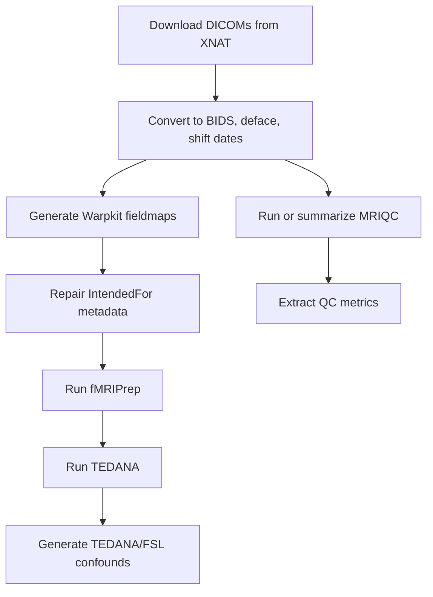

# RF1-SRA Linux2 fMRI Preprocessing

This repository contains the Smith Lab Linux2 preprocessing workflow for RF1-SRA
multi-echo fMRI data from the UGR, Social Doors, Trust, and Shared Reward tasks.
Behavioral task processing lives in separate repositories. This repository is
for MRI data management, BIDS conversion, fieldmap preparation, fMRIPrep,
TEDANA, MRIQC, and downstream confound/metric extraction helpers.

## Scope And Privacy

Raw DICOMs are not stored in GitHub. On Linux2 they live under the lab-controlled
source-data area, normally `/ZPOOL/data/sourcedata/sourcedata/rf1-sra`. BIDS
NIfTI images, fMRIPrep derivatives, TEDANA outputs, MRIQC reports, scheduler
logs, temporary files, and generated metrics are intentionally excluded from
version control. Tracked BIDS text files are limited to small metadata/event
files that are useful for review.

Production processing should occur on Smith Lab Linux2, where the normal
checkout is:

```bash
/ZPOOL/data/projects/rf1-sra-linux2
```

Do not run destructive production processing from an unreviewed branch. This
cleanup branch is repository-tested only and still requires Jacob's Linux2
integration validation before merge.

## Repository Layout

| Path | Purpose |
| --- | --- |
| `code/` | Production entry points, worker scripts, helpers, subject lists, and config examples. |
| `bids/` | Small tracked BIDS text/event metadata only; converted imaging data are ignored. |
| `derivatives/` | Generated outputs are ignored. Two legacy FLIRT helper scripts are currently preserved for human review. |
| `scripts/` | Repository validation scripts that do not require production imaging data. |
| `tests/` | Synthetic pytest coverage for parsing, path generation, safety checks, and completion checks. |

See `code/README.md` for the detailed implementation manual.

## Software

The current Linux2 defaults are documented in `code/config.example.env`:

| Tool | Default image/location |
| --- | --- |
| HeuDiConv | `/ZPOOL/data/tools/heudiconv_1.3.3.sif` |
| MRIQC | `/ZPOOL/data/tools/mriqc-24.0.2.simg` |
| fMRIPrep | `/ZPOOL/data/tools/fmriprep-25.2.5.simg` |
| Warpkit | `/ZPOOL/data/tools/warpkit.sif` |
| TemplateFlow | `/ZPOOL/data/tools/templateflow` |
| FreeSurfer license | `/ZPOOL/data/tools/licenses/fs_license.txt` |

The script comments historically said the scanner-upgrade heuristic cutoff was
March 18, 2025, while the code has used March 4, 2025 since the first Linux2
commit. This cleanup preserves the March 4 behavior and flags the discrepancy
for Jacob to confirm during Linux2 validation.

## Configuration

Linux2 defaults are built into `code/pipeline_common.sh`. To override paths in a
local checkout:

```bash
cp code/config.example.env code/config.env
```

Edit `code/config.env` as needed. It is ignored by Git. Common overrides include
`PROJECT_ROOT`, `SOURCEDATA_ROOT`, `SCRATCH_ROOT`, `TOOLS_ROOT`,
`FMRIPREP_IMAGE`, `MRIQC_IMAGE`, `HEUDICONV_IMAGE`, `WARPKIT_IMAGE`,
`TEMPLATEFLOW_HOME`, and `LICENSES_DIR`.

## Workflow



Quick start on Linux2:

```bash
cd /ZPOOL/data/projects/rf1-sra-linux2/code
python3 downloadXNAT.py
bash run_prepdata.sh --dry-run
bash run_prepdata.sh
bash run_warpkit.sh --dry-run
bash run_warpkit.sh
python3 addIntendedFor.py --dry-run
python3 addIntendedFor.py
bash run_fmriprep.sh --dry-run
bash run_fmriprep.sh
bash run_tedana.sh --dry-run
bash run_tedana.sh
python3 genTedanaConfounds.py --dry-run
python3 genTedanaConfounds.py
bash run_mriqc.sh --dry-run
bash run_mriqc.sh
python3 extract-metrics.py --dry-run
```

Subject lists are plain text files with one subject per line. Blank lines and
comments beginning with `#` are ignored, and either `10001` or `sub-10001` forms
are accepted by the wrappers.

## Safety And Reruns

Use `--dry-run` first for pipeline stages that support it. Existing BIDS
conversion output is no longer removed before HeuDiConv runs. `prepdata-linux2.sh`
stages conversion output in scratch and only installs it after the new session
exists. Replacing an existing BIDS session requires `--overwrite`, and the old
session is moved aside to a timestamped backup instead of being deleted.

Raw DICOM source directories are treated as immutable by preprocessing scripts.
Localizer directories are reported but no longer moved out of source data.

fMRIPrep skipping now checks for a practical set of expected outputs rather than
only an HTML report and session directory. This is a completion check, not a
scientific-validity guarantee. MRIQC, fMRIPrep, TEDANA, fieldmap metadata, and
confound outputs still require visual and scientific review on Linux2.

## Testing

Repository-level checks do not require real imaging data or neuroimaging
containers:

```bash
make test
```

The test command runs shell syntax checks, optional ShellCheck for active
scripts, Python compilation, synthetic pytest tests, JSON parsing, README path
validation, and a small temporary-file hygiene check.

## Development Workflow

Do not modify `main` directly. Create a branch from `origin/main`, commit small
coherent changes, push the branch, and open a draft pull request. The PR must
remain a draft until Jacob validates the revised workflow on Linux2 and David
approves it.

Historical repository size may still reflect previously tracked derivatives and
logs. This cleanup removes current tracked generated files only. Any history
rewrite would need a separate, coordinated `git filter-repo` plan.

## Outside Users And OpenNeuro

The README previously contained placeholder DataLad/OpenNeuro reproduction
commands. Outside-user reproduction is not currently documented end-to-end here.
Do not rely on those removed placeholders for public reproduction until the
OpenNeuro dataset identifier and instructions are confirmed.

## Citation And Acknowledgments

More project context appears in Smith et al., 2024, Data in Brief:
https://doi.org/10.1016/j.dib.2024.110810

This work was supported, in part, by grants from the National Institutes of
Health.
