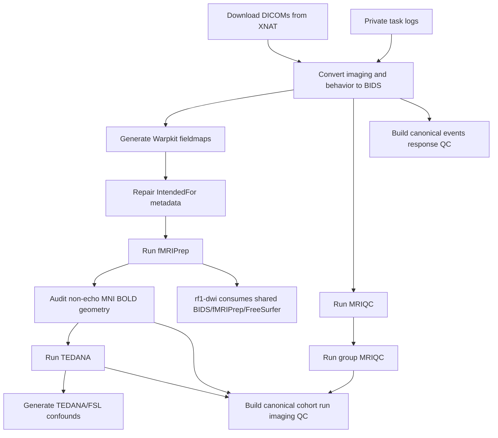

# RF1-SRA Linux2 fMRI Preprocessing

This repository contains the Smith Lab Linux2 preprocessing workflow for RF1-SRA
multi-echo fMRI data from the UGR, Social Doors, Trust, and Shared Reward tasks.
This repository owns MRI data management, imaging and behavioral BIDS
conversion, fieldmap preparation, fMRIPrep, FreeSurfer/CIFTI derivative
generation, TEDANA, MRIQC, downstream confound generation, and cohort-level
run imaging QC.

`rf1-sra-linux2` owns the canonical RF1-SRA BIDS dataset, including behavioral
`_events.tsv` files. Downstream scientific-analysis repositories consume these
BIDS events and should not read raw behavioral logs directly.

## Scope And Privacy

Raw DICOMs and private behavioral logs are not stored in GitHub. On Linux2 the
DICOMs live under `/ZPOOL/data/sourcedata/sourcedata/rf1-sra`, and behavioral
sources live under `/ZPOOL/data/projects/rf1-sra/stimuli`. BIDS NIfTI images,
fMRIPrep derivatives, TEDANA outputs, MRIQC reports, scheduler logs, temporary
files, and the generated `bids/` tree are intentionally excluded from version
control. Lightweight canonical QC tables, workbooks, policy, provenance, and
aggregate figures under `qc/` are intentionally tracked.

The private `/ZPOOL/data/sourcedata/sourcedata/rf1-sra-exclusions` directory
is authoritative for participant-level exclusions. Standard analysis and
OpenNeuro release builders must ignore source-excluded participants even when
residual BIDS or derivative outputs remain locally preserved. Future reuse
requires deliberate PI and data-governance review. Public reporting should
give only the aggregate number excluded from the final release because of
incidental findings; diagnoses, detailed findings, and participant-level
reason associations must not be published.

Production processing should occur on Smith Lab Linux2 from the production
checkout:

```bash
/ZPOOL/data/projects/rf1-sra-linux2
```

The scripts derive `PROJECT_ROOT` from the checkout that is running them, so a
separate validation clone can still write to its own `bids/`, `derivatives/`,
and `logs/` trees when one is intentionally created. Do not hard-code one
project root into wrappers or downstream commands.

Do not run destructive production processing from unreviewed local edits. Use
`--dry-run` first, keep logs, and require an explicit operator decision before
using `--overwrite`.

## Relationship To rf1-dwi

This repository is upstream of `rf1-dwi`. Run this fMRI/data-management workflow
first. It creates and maintains the shared BIDS dataset, fMRIPrep derivatives,
FreeSurfer subjects, and fsLR CIFTI outputs that `rf1-dwi` may consume for
QSIPrep/QSIRecon.

`rf1-dwi` should not duplicate BIDS, fMRIPrep, or FreeSurfer outputs. Instead,
point the DWI repo at the production Linux2 checkout for this repo:

```bash
BIDS_ROOT=/ZPOOL/data/projects/rf1-sra-linux2/bids
FMRIPREP_DERIVATIVES_DIR=/ZPOOL/data/projects/rf1-sra-linux2/derivatives/fmriprep
FREESURFER_SUBJECTS_DIR=/ZPOOL/data/projects/rf1-sra-linux2/derivatives/freesurfer
```

Historical validation checkout names are documented in
[validation history](docs/archive/validation-history.md), but they are not the
production defaults.

## Repository Layout

| Path | Purpose |
| --- | --- |
| `code/` | All production entry points, worker scripts, helpers, validation scripts, and the current batch subject list. |
| `bids/` | Generated BIDS dataset on Linux2; ignored by Git. |
| `derivatives/` | Generated outputs are ignored and should not contain repository code. |
| `qc/` | Tracked cohort-level imaging and events-response QC policies, canonical tables, workbooks, and figures. |
| `tests/` | Synthetic pytest coverage for parsing, path generation, safety checks, and completion checks. |

See `code/README.md` for the detailed implementation manual.

## Pipeline Map

The dependency order is:

```text
Raw DICOMs / XNAT
  + private RF1-SRA behavioral logs
  -> rf1-sra-linux2 imaging and behavioral BIDS conversion
  -> rf1-sra-linux2 Warpkit / IntendedFor
  -> rf1-sra-linux2 fMRIPrep / FreeSurfer / CIFTI
  -> rf1-sra-linux2 post-fMRIPrep geometry audit / reviewed repair
  -> rf1-sra-linux2 TEDANA / MRIQC / confounds
  -> rf1-sra-linux2 cohort-level run imaging and events-response QC
  -> rf1-dwi QSIPrep / QSIRecon
```

In this repository the modular stages are:


```mermaid
flowchart TD
  A["Download DICOMs from XNAT"] --> B["Convert imaging and behavior to BIDS"]
  K["Private task logs"] --> B
  B --> C["Generate Warpkit fieldmaps"]
  C --> D["Repair IntendedFor metadata"]
  D --> E["Run fMRIPrep"]
  E --> L["Audit non-echo MNI BOLD geometry"]
  L --> F["Run TEDANA"]
  F --> G["Generate TEDANA/FSL confounds"]
  B --> H["Run MRIQC"]
  H --> I["Run group MRIQC"]
  I --> M["Build canonical cohort run imaging QC"]
  L --> M
  F --> M
  B --> N["Build canonical events response QC"]
  E --> J["rf1-dwi consumes shared BIDS/fMRIPrep/FreeSurfer"]
```

## Standard Paths

The shared Linux2 source-data and tool paths are fixed in `code/pipeline_common.sh`.
The project root is derived from the checkout location so a separate validation
clone writes to its own `bids/`, `derivatives/`, and `logs/` directories.

| Item | Path |
| --- | --- |
| Production checkout | `/ZPOOL/data/projects/rf1-sra-linux2` |
| Production BIDS root | `/ZPOOL/data/projects/rf1-sra-linux2/bids` |
| Production fMRIPrep derivatives | `/ZPOOL/data/projects/rf1-sra-linux2/derivatives/fmriprep` |
| Production FreeSurfer subjects | `/ZPOOL/data/projects/rf1-sra-linux2/derivatives/freesurfer` |
| Source DICOMs | `/ZPOOL/data/sourcedata/sourcedata/rf1-sra` |
| Private behavioral source | `/ZPOOL/data/projects/rf1-sra/stimuli` |
| Scratch | `/ZPOOL/data/scratch` |
| Tool/container directory | `/ZPOOL/data/tools` |
| TemplateFlow | `/ZPOOL/data/tools/templateflow` |
| FreeSurfer license | `/ZPOOL/data/tools/licenses/fs_license.txt` |

Production writers honor the inherited process umask. Atomic Python writers
explicitly replace the forced-private `0600`/`0700` modes created by
`mkstemp()`/`mkdtemp()` with the modes ordinary file or directory creation
would receive. With the lab's `umask 0000`, generated files are `0666` and
generated directories are `0777`. A umask does not retroactively repair older
outputs. After pulling the permissions fix, repair the affected existing events
and tracked events-QC outputs once on Linux2:

```bash
cd /ZPOOL/data/projects/rf1-sra-linux2
find bids -type f -name '*_events.tsv' -exec chmod 0666 {} +
chmod -R a+rwX qc/events/results
```

| Tool | Default location/configuration |
| --- | --- |
| HeuDiConv | `/ZPOOL/data/tools/heudiconv-1.4.0.sif` |
| PyDeface | `/ZPOOL/data/tools/anaconda/tug87422/envs/pydeface-2.1/bin/pydeface` |
| MRIQC | `/ZPOOL/data/tools/mriqc-24.0.2.simg` |
| fMRIPrep | `/ZPOOL/data/tools/fmriprep-25.2.5.simg` |
| Warpkit | `/ZPOOL/data/tools/anaconda/tug87422/envs/warpkit-1.4.0/bin/wk-medic`; legacy fallback: `/ZPOOL/data/tools/warpkit.sif` with `WARPKIT_BACKEND=apptainer` |
| TEDANA | `/ZPOOL/data/tools/anaconda/tug87422/envs/tedana-26.0.3/bin/tedana` |
| TemplateFlow | `/ZPOOL/data/tools/templateflow` |
| FreeSurfer license | `/ZPOOL/data/tools/licenses/fs_license.txt` |

The script comments historically said the scanner-upgrade heuristic cutoff was
March 18, 2025, while the code has used March 4, 2025 since the first Linux2
commit. The production workflow preserves the March 4 behavior until David or
Jacob confirms a scientific correction.

## Subject Lists

Use subject lists in this order:

| Level | Purpose | Normal location |
| --- | --- | --- |
| Full production/cohort list | Run cohort-level MRIQC, metrics, and final completeness checks after all intended participants are present. | Lab-maintained full cohort list for final batch review. |
| New-batch list | Run newly available participants through the modular fMRI/data-management stages. | `code/sublist-new.txt` |
| Small validation list | Validate a workflow change with representative subjects before production use. | Local operator list, commonly under `logs/validation/` |

`code/sublist-new.txt` is the only file operators should normally edit for a
new incoming batch. It is a plain text file with one subject per line. Blank
lines and comments beginning with `#` are ignored, and either `10001` or
`sub-10001` forms are accepted by the wrappers. Scripts should not need edits
for routine new-batch processing.

For a small validation run, keep a separate review-only list and pass it with
`--sublist`:

```bash
cd /ZPOOL/data/projects/rf1-sra-linux2
mkdir -p logs/validation
printf '10317\n10953\n' > logs/validation/sublist-fmri-validation.txt

cd code
SUBLIST=../logs/validation/sublist-fmri-validation.txt
```

For full-cohort MRIQC and metric review, replace `sublist-new.txt` in the
examples with the lab-maintained full cohort list. Do not make a tiny
validation list or a new-batch list look like the final cohort list.

## Choosing `--jobs`

Start conservatively when the Linux2 load is unknown, then raise `--jobs` only
after the dry-run and the first real subject look healthy. Current defaults are
`run_prepdata.sh --jobs 6`, `run_mriqc.sh --jobs 8`,
`run_warpkit.sh --jobs 8`, `run_fmriprep.sh --jobs 2`, and
`run_tedana.sh --jobs 8`. The wrappers print their job plan before launching.

Each MRIQC session is capped at 8 processors, 4 OpenMP threads, and 20 GB RAM
by default. Override `MRIQC_NPROCS`, `MRIQC_OMP_NTHREADS`, or `MRIQC_MEM_GB`
when the host load warrants it. On an otherwise quiet Linux2, 10 simultaneous
sessions at those defaults have aggregate ceilings of 80 CPU threads and
200 GB RAM.

fMRIPrep is the tightest stage: `run_fmriprep.sh --jobs N` splits a fixed
Linux2 budget of 96 CPU threads and 196000 MB RAM across simultaneous subjects.
Use `--jobs 1` for debugging, keep the default `--jobs 2` for normal production
unless Linux2 is quiet and the operator intentionally raises it, and avoid
mixing high fMRIPrep concurrency with other heavy container stages.

## Everyday Use

Quick start on Linux2:

```bash
cd /ZPOOL/data/projects/rf1-sra-linux2/code
vim sublist-new.txt
SUBLIST=sublist-new.txt
PREP_JOBS=6
MRIQC_JOBS=8
WARPKIT_JOBS=8
FMRIPREP_JOBS=2
TEDANA_JOBS=8

python3 downloadXNAT.py

bash run_prepdata.sh --sublist "$SUBLIST" --jobs "$PREP_JOBS" --dry-run
bash run_prepdata.sh --sublist "$SUBLIST" --jobs "$PREP_JOBS"
bash check_bids.sh --sublist "$SUBLIST"

bash run_mriqc.sh --sublist "$SUBLIST" --jobs "$MRIQC_JOBS" --dry-run
bash run_mriqc.sh --sublist "$SUBLIST" --jobs "$MRIQC_JOBS"
bash check_mriqc.sh --sublist "$SUBLIST"

bash run_warpkit.sh --sublist "$SUBLIST" --jobs "$WARPKIT_JOBS" --dry-run
bash run_warpkit.sh --sublist "$SUBLIST" --jobs "$WARPKIT_JOBS"
bash check_warpkit.sh --sublist "$SUBLIST"

python3 addIntendedFor.py --sublist "$SUBLIST" --dry-run
python3 addIntendedFor.py --sublist "$SUBLIST"

bash run_fmriprep.sh --sublist "$SUBLIST" --jobs "$FMRIPREP_JOBS" --dry-run
bash run_fmriprep.sh --sublist "$SUBLIST" --jobs "$FMRIPREP_JOBS"
bash check_fmriprep.sh --sublist "$SUBLIST"

GEOMETRY_PYTHON=/ZPOOL/data/tools/anaconda/tug87422/envs/tedana-26.0.3/bin/python
GEOMETRY_PREFIX=../logs/geometry/fmriprep-geometry-$(date +%Y%m%d-%H%M%S)
AUDIT_JSON="${GEOMETRY_PREFIX}.json"
AUDIT_TSV="${GEOMETRY_PREFIX}.tsv"
"$GEOMETRY_PYTHON" fmriprep_geometry.py audit --report-prefix "$GEOMETRY_PREFIX"
"$GEOMETRY_PYTHON" fmriprep_geometry.py repair --audit-json "$AUDIT_JSON"

# Stop and review the complete audit TSV and repair preview. If outliers are
# reported and approved, apply the reviewed plan before running the checker:
"$GEOMETRY_PYTHON" fmriprep_geometry.py repair \
  --audit-json "$AUDIT_JSON" \
  --apply
"$GEOMETRY_PYTHON" fmriprep_geometry.py verify --audit-json "$AUDIT_JSON"

bash run_tedana.sh --sublist "$SUBLIST" --jobs "$TEDANA_JOBS" --dry-run
bash run_tedana.sh --sublist "$SUBLIST" --jobs "$TEDANA_JOBS"
bash check_tedana.sh --sublist "$SUBLIST"

python3 genTedanaConfounds.py --sublist "$SUBLIST" --dry-run
python3 genTedanaConfounds.py --sublist "$SUBLIST"
```

`--dry-run` means print or validate the planned work before launching the heavy
stage. `--sublist FILE` points a wrapper or checker at a review-specific subject
list instead of `code/sublist-new.txt`. `--jobs N` controls how many
subject-level jobs run at once; fMRIPrep also divides its CPU and memory budget
across those jobs.

### Reviewed Production Exceptions

Four historical/acquisition exceptions are intentionally narrow and
provenance-visible:

- `sub-12018` session 1 retains its downloaded DICOMs under the malformed inner
  folder `Smith-SRA-12018/Smith-SRA-/scans`. `prepdata.sh`, `check_bids.sh`, and
  `make_repair_runlists.py` recognize that source layout without moving or
  rewriting raw DICOMs.
- `sub-10929` session 1 UGR run 2 has complete magnitude data but an incomplete
  phase acquisition. The reviewed decision in `warpkit_reuse.tsv` reuses the
  UGR run-1 WarpKit fieldmap for run 2. Normal WarpKit jobs finish before reuse
  jobs; the run-2 magnitude reference remains run-specific, and the reused
  fieldmap receives explicit BIDS-side metadata plus derivative provenance.
- `sub-11116` session 2 was acquired across a primary visit and a short return
  visit intended to complete Social Doors/Doors. `supplemental_sources.tsv`
  declares
  the second immutable source folder. `prepdata.sh` exposes both folders through
  a temporary combined scan view and writes one `ses-02`; it does not create
  `ses-03` or alter sourcedata. If both visits contain a T1w, the XA30 heuristic
  writes stable `run-1` and `run-2` T1w files and defaces both. Conversion and
  behavioral validation must still establish which return-visit runs completed.
  Commit `7c6f768d0` recovered full August 27 behavior for both Doors and Social
  Doors: each has 40 decisions and zero misses. The BOLD series match the later
  completed Doors execution and the completed Faces execution with a stable
  task-computer-minus-scanner offset of approximately 252.8 seconds. The
  reviewed manifest row is therefore active.
- The private `sub-10617` Shared Reward run-1 source is restored from the
  rectangular 25-column parent version of the damaged historical edit, with
  only the leading `?TrialNumber` header corrected to `TrialNumber`. That source
  repair does not itself decide whether the lone raw run maps to imaging run 1
  or run 2; any such mapping still requires fingerprint-bound review.

These exceptions do not authorize a whole-subject exclusion, do not modify raw
DICOM content, and must not be generalized to other subjects without a new
reviewed manifest row.

The geometry commands are a required cohort-wide gate, including after a full
from-scratch rerun. Do not continue past that block until `verify` prints
`CHECK PASSED`. When the audit reports no outliers, omit the `--apply` command
and run `verify` directly. When it reports outliers, review `AUDIT_TSV` and the
repair preview before applying anything.

## Post-fMRIPrep Geometry Gate

Run the cohort geometry audit after fMRIPrep and before constructing downstream
analysis manifests. It intentionally has no subject-list option: every
non-echo, 4D, `space-MNI152NLin6Asym_desc-preproc_bold.nii.gz` under the
production fMRIPrep tree must participate. Echo-specific files, CIFTI files,
and pristine `bids/` inputs are outside this repair's scope.

The audit reads NIfTI headers, clusters spatial shape plus effective affine
using a small numerical tolerance, and chooses a modal grid only when the mode
is unique. It separately audits qform/sform matrices and intent codes against
the modal MNI metadata. It writes a detailed JSON repair contract and a
human-readable TSV.
It does not resample or replace anything. Invalid images and a tied mode are
blocking findings.

```bash
cd /ZPOOL/data/projects/rf1-sra-linux2/code
GEOMETRY_PYTHON=/ZPOOL/data/tools/anaconda/tug87422/envs/tedana-26.0.3/bin/python
STAMP=fmriprep-geometry-$(date +%Y%m%d-%H%M%S)
PREFIX="../logs/geometry/${STAMP}"

"$GEOMETRY_PYTHON" fmriprep_geometry.py audit \
  --report-prefix "$PREFIX"

AUDIT_JSON="${PREFIX}.json"
AUDIT_TSV="${PREFIX}.tsv"

awk -F '\t' 'NR == 1 || $1 != "modal"' "$AUDIT_TSV"
awk -F '\t' 'NR == 1 || $14 == "mismatch"' "$AUDIT_TSV"
awk -F '\t' 'NR == 1 || $2 == "12013"' "$AUDIT_TSV"
```

If a fresh audit reports no spatial outliers but reports qform/sform metadata
mismatches, use the dedicated metadata-only path. It freezes checksums for the
current inventory, preserves each affected derivative, verifies identical voxel
values, and never invokes ANTs:

```bash
"$GEOMETRY_PYTHON" fmriprep_geometry.py normalize-xforms \
  --audit-json "$AUDIT_JSON"

"$GEOMETRY_PYTHON" fmriprep_geometry.py normalize-xforms \
  --audit-json "$AUDIT_JSON" \
  --apply
```

Do not apply an older frozen audit after the fMRIPrep inventory changes. Create
a fresh audit and use `normalize-xforms` for metadata-only findings.

Before repair, independently confirm that the TSV contains every affected
task/run, including every listed `sub-12013` outlier. Also ensure no downstream
job is reading or writing the canonical fMRIPrep files. Preview is the default:

```bash
"$GEOMETRY_PYTHON" fmriprep_geometry.py repair \
  --audit-json "$AUDIT_JSON"
```

After reviewing the complete plan and available storage, apply and verify:

```bash
"$GEOMETRY_PYTHON" fmriprep_geometry.py repair \
  --audit-json "$AUDIT_JSON" \
  --apply

"$GEOMETRY_PYTHON" fmriprep_geometry.py verify \
  --audit-json "$AUDIT_JSON"
```

Repair copies each original into
`derivatives/fmriprep_geometry/originals/<audit-id>/`, records per-file JSON
provenance under `derivatives/fmriprep_geometry/repairs/<audit-id>/`, and uses
4D ANTs identity resampling with `LanczosWindowedSinc` interpolation from the
pinned fMRIPrep container. It validates the target grid, volume count, finite
values, and nonzero data, then copies the modal qform/sform matrices and MNI
intent codes before atomically replacing the original canonical fMRIPrep path.
A legacy repaired output that already matches the lattice but still has ANTs'
generic `1/1` transform codes receives a metadata-only repair and is not
interpolated again. Existing JSON sidecars remain in place. Downstream repositories
therefore continue to use ordinary fMRIPrep paths and need no outlier-specific
resolution logic.

The command refuses inventory drift, changed audit inputs, missing provenance,
nonstandard derivative roots, and every path under `bids/`. A repair can be
restarted after interruption: verified completed files are skipped, while
unrepaired originals remain pending. Preserve the audit JSON/TSV, original
backups, and repair provenance together. If downstream products were already
derived from a repaired canonical non-echo image, regenerate those products;
TEDANA's echo-specific inputs are not modified by this workflow.

The identity transform is stored as Insight transform text with a `.txt`
suffix. Do not rename it to `.mat`: ITK uses the extension to choose its
transform reader and would incorrectly treat the text file as MATLAB data.

The BOLD repair does not implicitly alter other fMRIPrep derivatives. After
the BOLD audit/repair/metadata gate passes, independently audit every canonical
BOLD against its companion `desc-brain_mask`. Preview and apply only the
reported mask mismatches. Spatial-grid mismatches are resampled with
nearest-neighbor interpolation and forced binary; metadata-only mismatches copy
qform/sform information without changing voxels. Originals are preserved with
checksums and masks are atomically replaced at their ordinary fMRIPrep paths:

```bash
MASK_STAMP=fmriprep-mask-$(date +%Y%m%d-%H%M%S)
MASK_PREFIX="../logs/geometry/${MASK_STAMP}"

"$GEOMETRY_PYTHON" fmriprep_mask_geometry.py audit \
  --report-prefix "$MASK_PREFIX"

MASK_AUDIT_JSON="${MASK_PREFIX}.json"
"$GEOMETRY_PYTHON" fmriprep_mask_geometry.py repair \
  --audit-json "$MASK_AUDIT_JSON"
"$GEOMETRY_PYTHON" fmriprep_mask_geometry.py repair \
  --audit-json "$MASK_AUDIT_JSON" --apply
"$GEOMETRY_PYTHON" fmriprep_mask_geometry.py verify \
  --audit-json "$MASK_AUDIT_JSON"
```

This companion-mask gate is cohort-wide and fail-closed. A changed BOLD
inventory or checksum requires a fresh audit. It never writes under `bids/`.

When changing Warpkit versions or backends, avoid mixing fieldmap provenance:
test one representative run with `warpkit.sh --overwrite`, then rerun
`run_warpkit.sh --overwrite`, `addIntendedFor.py`, and the Warpkit/IntendedFor
checks for the affected subject list before resuming fMRIPrep.

## Sessions And Expected Absences

Many RF1-SRA participants have both `ses-01` and `ses-02`. The production
wrappers try or discover both sessions, and optional missing `ses-02` source
data are reported as skips rather than hidden.

The current task/session rules are intentionally narrow and tested:

| Session | Expected tasks |
| --- | --- |
| `ses-01` | UGR, Trust, Shared Reward, Doors, Social Doors |
| `ses-02` | UGR, Doors, Social Doors |

UGR, Trust, and Shared Reward use runs 1 and 2 when present. Doors and Social
Doors generally lack run 2, so the wrappers and checkers expect run 1 only.
Some participants may intentionally lack a task or run; validation notes should
say whether an absence is expected or requires investigation.

A return visit that completes an interrupted scientific session remains in the
same BIDS session only after review. Such multi-folder sessions must be listed
in `code/supplemental_sources.tsv`; unlisted folders are never merged
automatically, and a `paused` row blocks the entire session. The merge is a
temporary symlink view in scratch, preserving the original source trees and
causing conversion to fail if any declared source is missing or contains no
DICOMs. Reviewed supplemental sessions may contain distinct DICOM
`StudyInstanceUID` values because the source folders come from separate scanner
visits. For those sessions only, `prepdata.sh` passes HeuDiConv
`--grouping all`, which treats the explicitly reviewed combined inventory as
one conversion session. Ordinary sessions retain HeuDiConv's default
study-UID grouping.

Historical task logs use task-specific run labels. Trust and UGR use raw
`run-0/run-1` for BIDS runs 1/2; Shared Reward has explicitly prompted for
one-based `run-1/run-2` labels since its first repository version. The behavior
converter resolves these conventions explicitly, treats untagged logs as
`ses-01`, requires explicit session labels for `ses-02`, and stops when more
than one source could map to the same BIDS run.

Behavior conversion is intentionally fail-closed. Exact column counts are
required, repeated headers, trial-number resets, and onset resets are treated
as evidence of appended runs, and malformed rows that claim `ran=1` stop the
conversion. Explicit `ran=0` placeholders are omitted automatically. A final
interrupted trial is also omitted when its required timing is incomplete and
every later row is explicitly `ran=0`; the omission is logged and makes the
run a short-run curation case rather than silently inventing an event duration.
Standard trial counts are Shared Reward 54, Trust 42, UGR 48, and Social
Doors/Doors 40.

A coherent short run or behaviorally poor run requires independent review in
`code/behavior_curation.tsv`. Each approval is tied to the exact source SHA-256
and ordered trial fingerprint, so changing the source invalidates the approval.
Structural corruption and multiple run segments cannot be approved away;
repair or split the private source first. A lone Shared Reward raw `run-1`
maps to BIDS run 1 by the task's documented one-based convention. Other source
ambiguities remain hard failures. Historical repairs and the remaining genuine
source gaps are recorded in `docs/behavior-source-repairs.md`.

For a small Linux2 validation list, prefer subjects that overlap with the
`rf1-dwi` validation subjects, such as `10317` and `10953`, when they cover
useful fMRI data. Because this repository must validate multi-session behavior,
the validation set should also include at least one `ses-01`, at least one
`ses-02`, at least one intentionally absent task/run, and ideally one
pre-upgrade and one post-upgrade scanner/heuristic case if available. Keep that
validation list under `logs/validation/` or another review-only location; do
not make it a production default unless David asks.

## Advanced: Logged Runs

Use `--dry-run` first for pipeline stages that support it. `prepdata.sh` runs
HeuDiConv, behavioral conversion, defacing, date shifting, and events
validation in scratch before it touches the live `bids/` tree. During an
imaging overwrite, only existing events whose task/run stems match staged BOLD
runs are preserved, then replaced when a validated behavioral source is
available. MRIQC is a separate restartable stage run by `run_mriqc.sh`;
reconverting BIDS data is not required to rerun MRIQC. Replacing an existing
BIDS session requires `--overwrite`; the old session is removed immediately
before the validated staged session is moved into place.

To backfill events for imaging sessions that are already converted, run the
standalone modular stage and then the checker:

```bash
bash run_convert_behavior.sh --sublist "$SUBLIST" --jobs 4 --dry-run --overwrite
bash run_convert_behavior.sh --sublist "$SUBLIST" --jobs 4 --overwrite
python3 check_events.py --sublist "$SUBLIST" \
  --review-tsv "../logs/reviews/events-$(date +%Y%m%d-%H%M%S).tsv"
```

After repairing or approving one reviewed source, retry only that exact run so
an unresolved sibling run is neither rewritten nor allowed to block it:

```bash
python3 convert_behavior.py --subject 10617 --session 01 \
  --tasks sharedreward --run 1 --overwrite
python3 check_events.py --subject 10617 --session 01 \
  --tasks sharedreward --run 1
```

`prepdata.sh` and `check_bids.sh` create the same kind of timestamped report
under `logs/reviews/`. A report row is a request for independent review, not an
exclusion decision. After review, copy only the approval fields into
`code/behavior_curation.tsv` and record the reviewer and rationale. Never add
trial-level behavioral data to Git. For an existing BIDS tree, combine
`--dry-run --overwrite`: dry-run prevents writes, while overwrite declares the
replacement that the preview is meant to validate. All shell stage wrappers
and shell checkers that consume standard subject lists skip IDs represented under
`/ZPOOL/data/sourcedata/sourcedata/rf1-sra-exclusions` even when residual BIDS
or production-source copies exist. This exclusion directory takes precedence
over every other source or output location. `prepdata.sh` and
`run_convert_behavior.sh` expose `--include-source-excluded`; for other shell scripts,
`RF1_INCLUDE_SOURCE_EXCLUDED=1` is reserved for deliberate forensic audits.

OpenNeuro `ds005123` version `1.1.3` can be used as a frozen historical
cross-check after downloading it locally. It is not production input and has
known UGR, Shared Reward, and Trust issues. The audit distinguishes a same-run
match from a match to the other public run, which is a high-priority run-swap
risk. It compares ordered trial identity only, never onset or duration. Doors
and Social Doors therefore provide the strongest comparison. Trust ignores the
known duration difference and tolerates the public export's omitted trials as
an ordered partial match. Shared Reward compares partner/outcome order while
treating private misses as wildcards because the public export retained the
scheduled outcome. UGR uses only sociality/endowment order and is supporting
evidence rather than a definitive match:

```bash
python3 audit_openneuro_events.py \
  --sublist "$SUBLIST" \
  --openneuro-root /path/to/ds005123-1.1.3 \
  --report-tsv "../logs/reviews/openneuro-events-$(date +%Y%m%d-%H%M%S).tsv"
```

Run the matching `check_*.sh` script after each major stage. These scripts end
with `CHECK PASSED` or `CHECK FAILED`, so a terminal transcript or ignored log
file has a clear final answer about operational completion.

For runs that should leave a compact GitHub-visible audit trail, use
`code/run_logged.sh`. It writes the full raw terminal output to ignored
`logs/runs/` and writes a small Markdown record to tracked `logs/records/`.
The `--` marker means `run_logged.sh` options stop and the real command starts.
The optional `--check` marker starts a checker command that runs only after the
main command exits 0. If no check is supplied, the record says `Check exit:
none`; if the main command fails, the check is skipped.

Raw DICOM source directories are treated as immutable by preprocessing scripts.
Localizer directories are reported but no longer moved out of source data.

fMRIPrep skipping now checks for a practical set of expected outputs rather than
only an HTML report and session directory. Current fMRIPrep runs also generate
FreeSurfer subjects under `derivatives/freesurfer` and fsLR CIFTI outputs under
`derivatives/fmriprep` so those derivatives can be reused by a separate DWI
workflow such as QSIPrep/QSIRecon. This is a completion check, not a
scientific-validity guarantee. `run_fmriprep.sh --jobs N` controls how many
subjects run at once and divides the Linux2 fMRIPrep resource budget across
those jobs before passing `--nprocs`, `--omp-nthreads`, and `--mem` into
fMRIPrep. MRIQC, fMRIPrep, TEDANA, fieldmap metadata, and confound outputs
still require visual and scientific review on Linux2.

## Full-Cohort Imaging QC

Run the group MRIQC report after the full participant batch completes
participant MRIQC. Build canonical run imaging QC only after MRIQC, TEDANA,
and the post-fMRIPrep geometry gate are complete. Do not use cohort Tukey
thresholds as a routine new-subject validation gate.

The run inventory comes from acquired BIDS echo-2 magnitude runs. The canonical
table combines MRIQC echo-2 tSNR and mean FD, TEDANA final rejected-component
counts, and fMRIPrep MNI brain coverage. `task-socialdoors` and `task-doors`
remain separate run rows but share one pooled Social Doors threshold
distribution.

```bash
cd /ZPOOL/data/projects/rf1-sra-linux2/code
bash mriqc_group.sh --dry-run
bash mriqc_group.sh
QC_PYTHON=/ZPOOL/data/tools/anaconda/tug87422/envs/tedana-26.0.3/bin/python
"$QC_PYTHON" -c 'import numpy, pandas, nibabel, scipy, matplotlib, openpyxl'
"$QC_PYTHON" build_run_qc.py build --dry-run
STAMP=run-qc-$(date +%Y%m%d-%H%M%S)
bash run_logged.sh --label "$STAMP" --include-full-log -- \
  "$QC_PYTHON" build_run_qc.py build \
  --check "$QC_PYTHON" build_run_qc.py check
```

The builder writes tracked outputs under `qc/`; rerunning over existing outputs
requires `build --overwrite`. The checker fails if any acquired run is missing
a primary metric, if live upstream inputs disagree with the table, or if the
recorded thresholds and flags cannot be reproduced. Imaging outliers are
run-level facts, not automatic participant exclusions. See [the QC
manual](qc/README.md) for exact definitions and provenance.

## TEDANA Audit And Sentinel Benchmark

The historical `derivatives/tedana` tree remains the production baseline. A
separate audit-only workflow inventories NSS handling, PCA and ICA dimensionality,
actual nuisance-matrix rank, residual degrees of freedom, accepted/rejected
variance, motion summaries, and component-wise Motion24 fits
without changing classifications. It then selects a balanced sentinel set for
controlled TEDANA 26.0.3 comparisons of T2*/optimal-combination NSS exclusion,
NSS-aware FastICA, and NSS-aware RobustICA.

All experimental images and component-level tables remain ignored under
`derivatives/tedana-audit/`; only aggregate tables, figures, provenance, and the
scientific report belong under `qc/tedana_audit/`. Do not modify production
`tedana.sh`, confound generation, or QC thresholds until the sentinel report is
complete and reviewed. See the [TEDANA audit manual](qc/tedana_audit/README.md)
for the staged Linux2 commands and interpretation gate.

After all four sentinel configurations pass, `summarize_tedana_benchmark.py`
builds the tracked paired T2*/optcom, ICA, and denoising comparisons. Its checker
requires exact sentinel coverage, live-input provenance, finite metrics, and
numerically identical `NSS=0` controls. These audit summaries remain an evidence
gate, not a production configuration change.

After the optional Motion24 FastICA and RobustICA passes validate,
`summarize_tedana_motion.py` builds tracked run/task summaries and a compact
component-review manifest while retaining the complete component table under
ignored audit derivatives. Its descriptive Motion24 thresholds do not alter
classification or authorize a production migration.

The dimensionality extension adds a matched `full-fastica` condition whose only
difference from `nss-fastica` is the validated `--dummy-scans` count. This
isolates NSS handling from the explicit-mask difference that confounds the
historical production comparison. `audit_tedana_design.py` independently
reconstructs every production nuisance table, verifies existing generated
files, extracts saved AIC/KIC/MDL estimates, and measures numerical rank plus
pre-task residual degrees of freedom. `summarize_tedana_dimensionality.py`
validates the matched sentinel comparison and exact NSS=0 controls. These
outputs support, but do not themselves authorize, a production change or an
upstream issue.

Targeted AIC/KIC/MDL audit runs are interpreted by
`summarize_tedana_pca_methods.py`. That summary requires identical optcom inputs
and jointly reports model order, rejected-component burden, exact nuisance rank,
remaining degrees of freedom, tSNR, DVARS, motion coupling, signal scale, and
denoised-image similarity. Because clean fMRI has no observed gold standard, no
single proxy or smaller component count is treated as evidence of superior
denoising.

The final decision pass evaluates RF1's actual analysis architecture. RF1
starts from full-length fMRIPrep BOLD and estimates task EVs, selected fMRIPrep
confounds, and rejected TEDANA IC timecourses simultaneously in one FEAT GLM.
It does not aggressively residualize BOLD before task modeling. Accordingly,
the final pass prioritizes incremental nuisance rank, residual DF, task-EV
R-squared/VIF, task-subspace overlap, and canonical contrast efficiency. An
audit-only in-memory nuisance projection supplies task-independent DVARS,
motion-coupling, temporal, and variance-control comparisons; it never creates
or replaces a production BOLD image.

Additional forensic stages compare acquisition metadata, raw public DICOM
headers, reconstructed echo properties, PCA behavior, and within-subject pairs
across E11, XA30, and XA60. The raw-header stage uses the additive dependency
pinned in `requirements-tedana-audit.txt`; its runbook installs that package
with `--no-deps` to preserve the working TEDANA environment. A twelve-run,
five-seed FastICA check evaluates
classification, nuisance rank, and adjusted-data stability without matching
component numbers. `build_tedana_final_report.py` will write the decision-facing
report only when every required evidence table exists and passes its checker.
No production TEDANA setting changes until that report receives scientific
review.

## Full-Cohort Events Response QC

After the canonical events backfill and `check_events.py` audit, build the
separate response-pattern QC. This read-only stage counts response opportunities
and misses, measures longest and terminal miss streaks, and reports the onset of
a sustained terminal block. It does not edit BIDS, trim imaging, or make final
run-inclusion decisions.

The historical 25% Social Doors/Doors rule is retained as a review threshold.
Applying it to other tasks is descriptive pending an explicit cross-task policy
decision. A terminal-failure candidate has at least five consecutive misses at
the end of a run. A salvage review candidate also has at least 40% of expected
trials before that block and a preterminal miss fraction below 25%.

```bash
cd /ZPOOL/data/projects/rf1-sra-linux2/code
QC_PYTHON=/ZPOOL/data/tools/anaconda/tug87422/envs/tedana-26.0.3/bin/python

"$QC_PYTHON" build_events_qc.py build --dry-run

STAMP=events-response-qc-$(date +%Y%m%d-%H%M%S)
bash run_logged.sh --label "$STAMP" --include-full-log -- \
  "$QC_PYTHON" build_events_qc.py build --overwrite \
  --check "$QC_PYTHON" build_events_qc.py check
```

The canonical tables, provenance, and figures are written under
`qc/events/results/`. Review those outputs and confirm suspected button-box
failures independently before designing a derivative-preserving functional
trimming workflow. By default, the builder discovers the current BIDS cohort
and omits subjects in the authoritative source-exclusions directory. Use
`--sublist` only for a deliberately frozen, documented cohort snapshot. See the
[events response-QC manual](qc/events/README.md).

## How To Know Whether It Worked

Look for these signals:

- `Command exit: 0` means the main command finished successfully.
- `Check exit: 0` means the checker command passed.
- `Check exit: none` means no checker was provided.
- `Check exit: skipped` means the main command failed, so output validation did
  not run.
- `CHECK PASSED` is the clearest phrase to search for at the end of a checker
  log or compact run record.
- `CHECK FAILED` means expected operational outputs are incomplete; inspect the
  newest Markdown record under `logs/records/`, then the matching raw log under
  `logs/runs/`.
- The post-fMRIPrep geometry gate must end with `CHECK PASSED` for the complete
  cohort inventory before downstream analysis manifests are constructed.
- `build_run_qc.py check` must end with `CHECK PASSED`; `incomplete` is a
  distinct state and never an implicit pass or outlier.
- `build_events_qc.py check` must end with `CHECK PASSED`; review flags may
  remain after a technically complete audit and require scientific adjudication.

## Before Asking For Help

When asking David or Jacob for help, send the command, the newest
`logs/records/*.md` file, whether `Command exit` and `Check exit` are 0, the
first `CHECK FAILED` or error line, and whether the case was expected to have
`ses-01`, `ses-02`, and the task/run being checked.

## More Details

- [Code manual](code/README.md)
- [Run imaging QC manual](qc/README.md)
- [TEDANA audit and sentinel benchmark](qc/tedana_audit/README.md)
- [Events response-QC manual](qc/events/README.md)
- [Open decisions and run-disposition roadmap](docs/open-decisions.md)
- [Validation history](docs/archive/validation-history.md)

Repository-level checks do not require real imaging data or neuroimaging
containers:

```bash
make test
```

The test command runs shell syntax checks, optional ShellCheck for active
scripts, Python compilation, synthetic pytest tests, JSON parsing, README path
validation, and a small temporary-file hygiene check.

## Development Workflow

Keep production changes small and coherent. For ordinary development, create a
branch from `origin/main`, commit focused changes, push the branch, and open a
pull request. When maintainers intentionally work directly on `main`, use the
same discipline: inspect the diff, run `make test`, and push only reviewed
documentation or code changes.

Historical repository size may still reflect previously tracked derivatives and
logs. Current generated imaging outputs stay ignored. Any history rewrite would
need a separate, coordinated `git filter-repo` plan.

## Outside Users And OpenNeuro

The README previously contained placeholder DataLad/OpenNeuro reproduction
commands. Outside-user reproduction is not currently documented end-to-end here.
Do not rely on those removed placeholders for public reproduction until the
OpenNeuro dataset identifier and instructions are confirmed.

## Citation And Acknowledgments

More project context appears in Smith et al., 2024, Data in Brief:
https://doi.org/10.1016/j.dib.2024.110810

This work was supported, in part, by grants from the National Institutes of
Health.
